# Sistem Penggajian (Payroll Management System)

Aplikasi web untuk mengelola penggajian karyawan — data master (karyawan, jabatan, golongan, pendapatan, potongan), proses penggajian bulanan dengan perhitungan PPh 21 & BPJS otomatis, slip gaji, laporan (export Excel), dashboard analitik, serta manajemen user dengan kontrol akses berbasis role (RBAC).

Frontend ini dibangun dengan React (Create React App) dan mengonsumsi REST API dari backend terpisah ([API-PAYROLL](https://github.com/dickyadem/API-PAYROLL), live di `https://api-payroll.vercel.app`).

**Live Demo**: [dickyadem.github.io/AplikasiPenggajianReactJS](https://dickyadem.github.io/AplikasiPenggajianReactJS/)

---

## Tech Stack

- **React 18** (Create React App / `react-scripts`)
- **React Router v6** — routing & route protection berbasis role
- **React-Bootstrap 5** — komponen UI (Bootstrap 5.3)
- **@phosphor-icons/react** — satu-satunya icon library yang dipakai di seluruh app (weight & size distandarkan lewat `IconContext.Provider` di `App.js`)
- **Axios** — HTTP client (`src/services/HTTPService.js`), otomatis kirim token via header `x-access-token`
- **Chart.js + react-chartjs-2** — grafik di Dashboard
- **xlsx** — export data ke Excel
- **gh-pages** — deploy ke GitHub Pages

---

## Fitur Utama

| Modul | Deskripsi |
|---|---|
| **Dashboard** | Ringkasan total karyawan, total gaji, progress penggajian, breakdown pendapatan/potongan, grafik tren 6 bulan, distribusi karyawan per divisi |
| **Master Data** | CRUD Karyawan, Jabatan, Golongan, Pendapatan, Potongan, Profil Perusahaan |
| **Penggajian** | Input penggajian dengan kalkulasi otomatis PPh 21 & BPJS, list & riwayat penggajian |
| **Laporan** | Laporan List Penggajian, Laporan BPJS, Laporan PPh — bisa di-export ke Excel |
| **User Management** | Kelola akun user & role (admin only) |
| **RBAC** | Kontrol akses per halaman/aksi berdasarkan role, lihat tabel role di bawah |
| **Notifikasi** | Dropdown notifikasi di navbar (tersambung ke `GET /notifications`) |
| **Profile** | Edit profil sendiri (tersambung ke `GET/PUT /user/me`) |

---

## Dokumentasi Tampilan

### Login

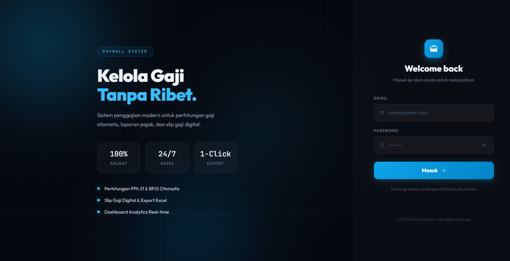

### Dashboard

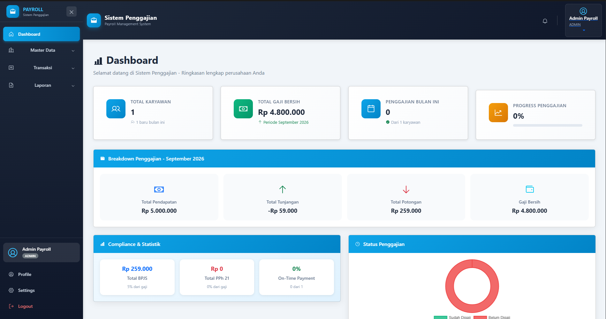
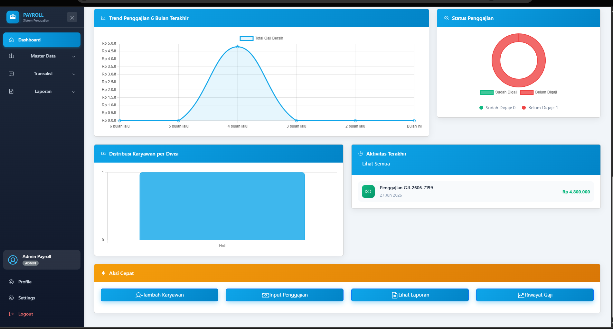

### Data Master

| Modul | Tampilan |
|---|---|
| Data perusahaan | 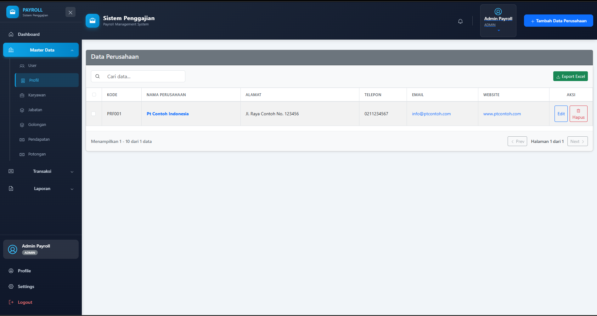 |
| Karyawan | 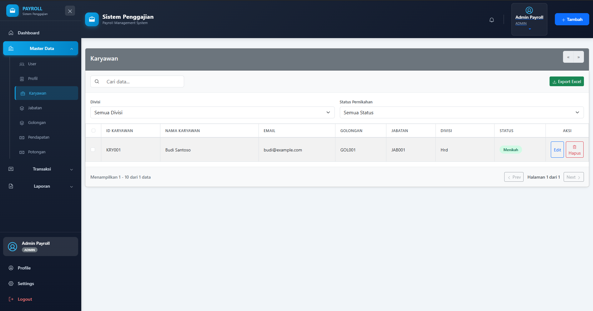 |
| Jabatan |  |
| Golongan | 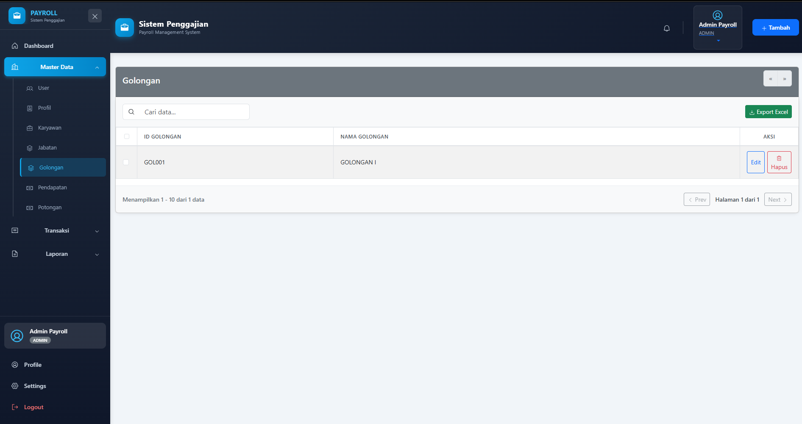 |
| Pendapatan | 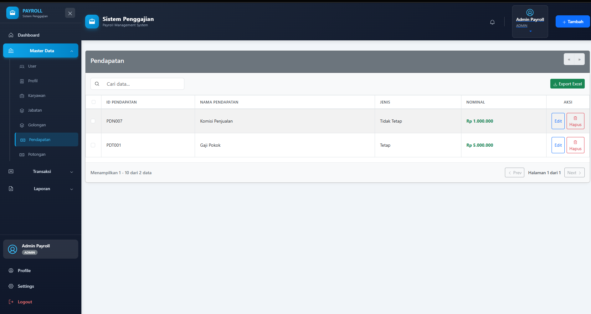 |
| Potongan | 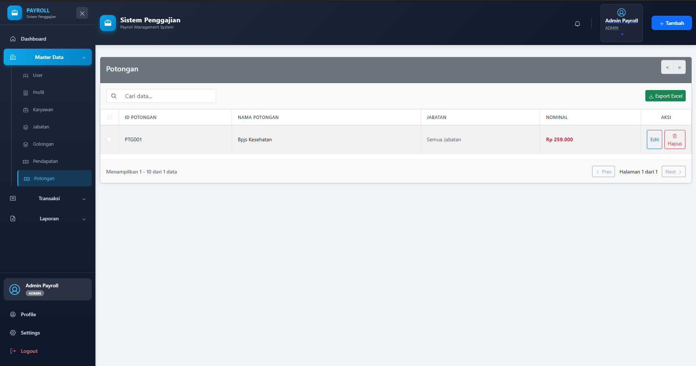 |
| User | 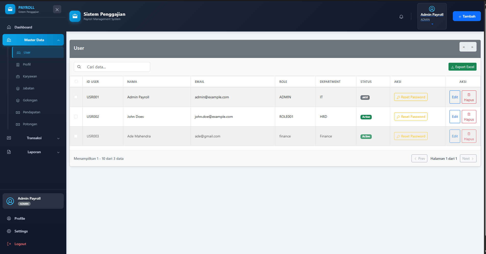 |

### Penggajian dan Laporan

#### Input Penggajian

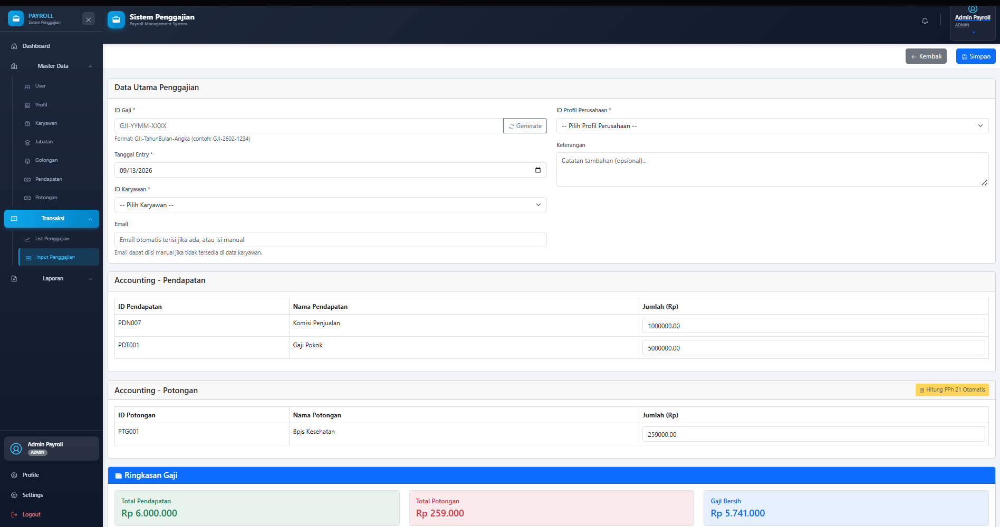

#### List Penggajian

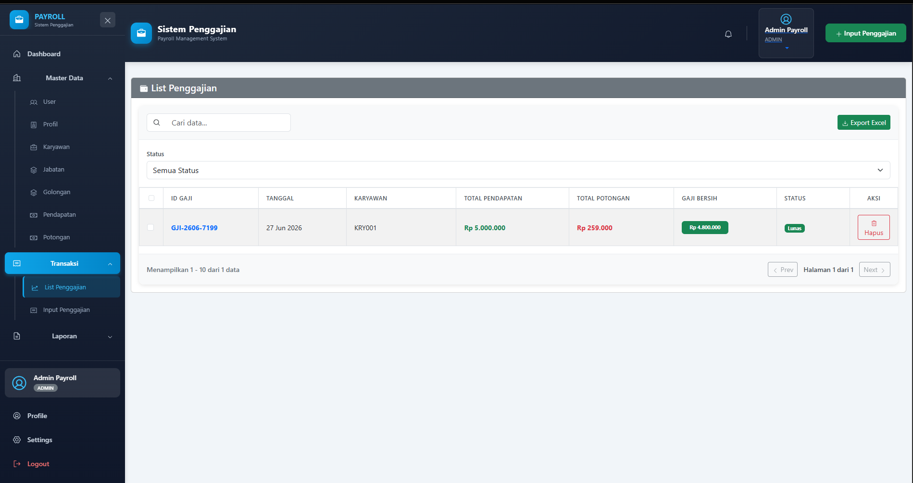

#### Laporan Gaji

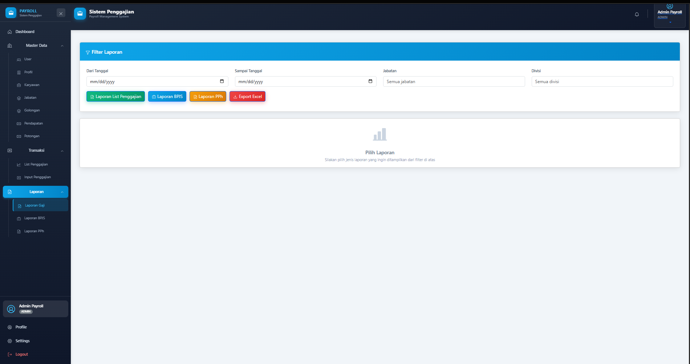

---

## Role & Hak Akses

Role bertingkat (level lebih tinggi otomatis punya akses level di bawahnya untuk pengecekan `hasRoleOrHigher`):

```
employee (1) < finance (2) < hr_staff (3) < manager (4) < admin (5)
```

| Halaman / Aksi | employee | finance | hr_staff | manager | admin |
|---|:---:|:---:|:---:|:---:|:---:|
| Dashboard, Profile | ✅ | ✅ | ✅ | ✅ | ✅ |
| Master Data (Karyawan, Jabatan, Golongan, Profil) | ❌ | ❌ | ✅ | ✅ | ✅ |
| Pendapatan, Potongan | ❌ | ✅ | ✅ | ✅ | ✅ |
| List Penggajian (lihat) | ❌ | ✅ | ✅ | ✅ | ✅ |
| Input Penggajian | ❌ | ✅ | ✅ | ❌ | ✅ |
| Laporan | ❌ | ✅ | ✅ | ✅ | ✅ |
| Kelola User (list, tambah, edit, reset password) | ❌ | ❌ | ❌ | ❌ | ✅ |
| Settings, RBAC Test | ❌ | ❌ | ❌ | ❌ | ✅ |

> Manager sengaja **tidak** diberi akses Input Penggajian — perannya review/approve laporan, bukan input data (pemisahan tugas/*separation of duties*). Employee tidak diberi akses manajemen apa pun untuk menghindari konflik kepentingan (mis. tidak bisa input gaji sendiri).

Implementasi:
- Pembatasan route ada di `src/App.js` (prop `requiredRole` / `requiredRoles` pada `<ProtectedRoute>`)
- Pembatasan menu sidebar ada di `src/widgets/commons/Sidebar.js` (properti `roles` per item menu, harus selalu sinkron dengan `App.js`)
- Akses ditolak diarahkan ke halaman `/unauthorized`, bukan ke halaman login (kecuali memang belum login)

---

## Struktur Folder

```
src/
├── pages/            # Satu folder per modul/halaman (dashboard, karyawan, jabatan, golongan,
│                        pendapatan, potongan, penggajian, laporan, profil, profile, user,
│                        settings, rbac, auth)
├── widgets/           # Komponen reusable (Sidebar, NavigationWidget, AdvancedTable, Toast,
│                        search/choice widget per modul, dsb.)
├── services/          # Satu file per resource API (KaryawanService, GajiService, UserService,
│                        NotificationService, HTTPService, AuthService, dst.)
├── hooks/             # Custom hooks (mis. useToast)
├── utils/             # Helper (format currency/date, export Excel, kalkulator PPh 21)
├── App.js             # Definisi seluruh route + proteksi role
└── config.js          # BASE_URL API (dari env REACT_APP_API_URL)
```

---

## Getting Started

### Prasyarat
- Node.js (versi yang kompatibel dengan `react-scripts@5`)
- Backend API sudah jalan (lokal di `http://localhost:4000` atau pakai production `https://api-payroll.vercel.app`)

### Instalasi
```bash
npm install
```

### Konfigurasi environment
Buat `.env` di root project kalau ingin override base URL API (default fallback ke production):
```env
REACT_APP_API_URL=http://localhost:4000
```

### Menjalankan secara lokal
```bash
npm start
```
Buka [http://localhost:3000](http://localhost:3000).

### Build production
```bash
npm run build
```

### Deploy ke GitHub Pages
```bash
npm run deploy
```
(Menjalankan `predeploy` → `npm run build`, lalu publish folder `build` via `gh-pages`. Live di `https://dickyadem.github.io/AplikasiPenggajianReactJS`.)

> Catatan: `package.json` punya field `homepage` yang di-set ke URL GitHub Pages tersebut — CRA memakainya untuk menghitung `PUBLIC_URL`. `BrowserRouter`'s `basename` di `App.js` dibuat kondisional (`process.env.NODE_ENV === 'production'`) supaya dev server tetap jalan normal dari `localhost:3000/` root, sementara build production tetap routing dengan benar di bawah `/AplikasiPenggajianReactJS/`.

---

## Dokumentasi Lain

- **Backend API reference** — lihat repo [API-PAYROLL](https://github.com/dickyadem/API-PAYROLL) untuk source code backend
- **RBAC_INTEGRATION.md** — panduan awal integrasi RBAC (role, testing scenario)
- **EXPORT_EXCEL_GUIDE.md** — cara pakai fitur export Excel di komponen lain

> `DEPLOYMENT_NOTES.md` dan `FE_API_GUIDE.md` ada di root project tapi **tidak ikut ke repo** (masuk `.gitignore`) — keduanya catatan kerja lokal berisi kontrak API terbaru, kredensial deployment, dan daftar bug/TODO yang sedang di-tracking bareng tim backend.

---

## Scripts

| Command | Fungsi |
|---|---|
| `npm start` | Jalankan dev server |
| `npm run build` | Build production ke folder `build/` |
| `npm test` | Jalankan test runner (CRA/Jest) |
| `npm run deploy` | Build + publish ke GitHub Pages |
| `npm run eject` | Eject konfigurasi CRA (irreversible, hindari kecuali benar-benar perlu) |
